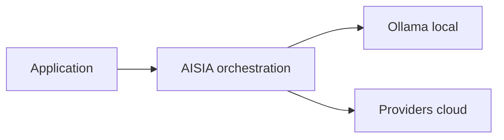

<!-- GENERATED:09_publications:start -->
<!--
  GÉNÉRÉ — ne pas éditer à la main.
  Source: scripts/generate/09_publications.py
  Régénérer: python3 scripts/aisia.py regen
  Gate deploy: python3 scripts/release/deploy.py <ver> --mode docs
-->

# terraform-ovh-aisia

> **v6.12.71** — module registry — bootstrap OVH + substrat AISIA

## Cœur d'AISIA (identité produit)

AISIA est le **chef d'orchestre IA local-first** : une requête entre, le meilleur modèle (local ou cloud) exécute, la réponse sort traçable et gouvernée.

**Fonction première** : orchestrer chaque requête IA en **local-first** (Ollama sur cluster)
puis cloud si nécessaire — via `BanditRouter`, pas un simple reverse-proxy.

**Différenciation** : orchestration local-first — pas un proxy LLM stateless.

| vs proxy LLM | AISIA |
|--------------|-------|
| 1 provider fixe | **88** providers déclarés |
| Catalogue modèles | **3275** modèles catalogue · **115** locaux déclarés · **58** locaux actifs |
| Stateless | Qdrant + audit AI Act + multi-tenant |
| SaaS opaque | Déployable Swarm/K8s — **v6.12.71** LIVE |

Documentation : [README racine](../../../../README.md) ·
[Product Identity](../../../../specification/03-Project-State/Product-Identity-AISIA.md)




---
<!-- GENERATED:09_publications:end -->

## Architecture

```
Projet Public Cloud OVH (service_name)
  └─ MKS Cluster (update_policy=MINIMAL_DOWNTIME)
       ├─ Node pool "primary" (b2-7 × node_count, autoscale optionnel)
       └─ Node pool "gpu"    (t1-45, autoscale 0→4, optionnel — gpu_enabled=true)
```

## Usage

```hcl
provider "ovh" {
  endpoint = "ovh-eu"
  # Credentials via env vars OVH_APPLICATION_KEY / OVH_APPLICATION_SECRET / OVH_CONSUMER_KEY
}

provider "kubernetes" {
  host                   = module.aisia_ovh_k8s.cluster_endpoint
  client_certificate     = module.aisia_ovh_k8s.client_certificate
  client_key             = module.aisia_ovh_k8s.client_key
  cluster_ca_certificate = module.aisia_ovh_k8s.cluster_ca_certificate
}

# L1 — substrat MKS
module "aisia_ovh_k8s" {
  source  = "app.terraform.io/AISIA/aisia/ovh"
  version = "~> 1.0"

  org_id       = "acme"
  service_key  = "C1"
  service_name = "your-ovh-project-id"
  image_tag    = "v6.12.71"
  tier         = "saas"

  region       = "GRA11"
  node_count   = 2
}

# L2 — déploiement AISIA
module "aisia_app" {
  source  = "app.terraform.io/AISIA/aisia-cluster/kubernetes"
  version = "~> 1.0"

  image_tag = "v6.12.71"
  tier      = "saas"
  domain    = "acme.aisia.fr"
}
```

## Inputs

| Nom | Description | Type | Défaut | Requis |
|-----|-------------|------|--------|--------|
| `org_id` | Identifiant de l'organisation AISIA (tenant) | `string` | — | oui |
| `service_key` | Brique déployée (C1..C11) | `string` | — | oui |
| `service_name` | ID du projet OVH Public Cloud | `string` | — | oui |
| `runtime_kind` | edge \| compute \| compute-gpu \| data \| ops \| security | `string` | `"compute"` | non |
| `substrate` | Substrat cible (ce module = k8s) | `string` | `"k8s"` | non |
| `profile` | Profil de dimensionnement (S \| M \| L \| XL) | `string` | `"S"` | non |
| `node_count` | Nombre de nœuds du pool principal | `number` | `1` | non |
| `instance_flavor` | Flavor OVH MKS (b2-7 = 2 vCPU / 7 GB) | `string` | `"b2-7"` | non |
| `image_registry` | Registry des images AISIA | `string` | `"registry.aisia.fr"` | non |
| `image_tag` | Tag d'image AISIA à déployer | `string` | `"v6.12.71"` | non |
| `domain` | Domaine custom (vide = *.aisia.fr) | `string` | `""` | non |
| `tier` | Offre tarifaire (saas \| baas \| paas) | `string` | `"saas"` | non |
| `gpu_enabled` | Provisionner un node pool GPU | `bool` | `false` | non |
| `region` | Région OVH MKS (GRA11, SBG5, EU-WEST-PAR) | `string` | `"GRA11"` | non |
| `cluster_name` | Préfixe du cluster MKS | `string` | `"aisia-ovh"` | non |
| `kube_version` | Version Kubernetes MKS (vide = dernière OVH) | `string` | `""` | non |
| `node_pool_autoscale` | Activer l'autoscaling du pool principal | `bool` | `false` | non |
| `node_pool_min_nodes` | Min nœuds (autoscale actif) | `number` | `1` | non |
| `node_pool_max_nodes` | Max nœuds (autoscale actif) | `number` | `3` | non |
| `gpu_flavor` | Flavor GPU OVH (t1-45, t2-45, a10-45) | `string` | `"t1-45"` | non |

## Outputs

| Nom | Description | Sensible |
|-----|-------------|----------|
| `cluster_id` | ID du cluster MKS OVH | non |
| `cluster_name` | Nom du cluster MKS | non |
| `cluster_status` | Statut du cluster (READY après convergence) | non |
| `cluster_endpoint` | Endpoint API server MKS | oui |
| `client_certificate` | Certificat client MKS (PEM) | oui |
| `client_key` | Clé client MKS (PEM) | oui |
| `cluster_ca_certificate` | CA certificate MKS (PEM) | oui |
| `kubeconfig` | Kubeconfig complet | oui |
| `kubeconfig_command` | Commande pour exporter le kubeconfig | non |
| `region` | Région OVH du déploiement | non |
| `node_count` | Nœuds désirés sur le pool principal | non |
| `gpu_pool_enabled` | Node pool GPU provisionné ? | non |

## Prérequis

- OpenTofu >= 1.5 ou Terraform >= 1.5
- Provider `ovh/ovh ~> 0.50`
- Credentials OVH via env vars `OVH_APPLICATION_KEY` / `OVH_APPLICATION_SECRET` / `OVH_CONSUMER_KEY`
- Projet OVH Public Cloud existant (`service_name`)
- Module `terraform-aisia-cluster ~> 1.0` pour déployer l'application

## Licence

[Mozilla Public License 2.0](LICENSE) — Copyright (c) 2026 AISIA (Sébastien Lambert).

## Référence des variables & sorties (auto-générée)

<!-- BEGIN_TF_DOCS -->
### Inputs (parité `variables.tf`)

| Name | Type | Default | Description |
|------|------|---------|-------------|
| `org_id` | `string` | `—` | Identifiant de l'organisation AISIA (tenant). |
| `service_key` | `string` | `—` | Brique déployée (C1..C11). |
| `runtime_kind` | `string` | `"compute"` | edge | compute | compute-gpu | data | ops | security. |
| `substrate` | `string` | `"k8s"` | Substrat cible. Ce module provisionne le substrat 'k8s' (OVH MKS). |
| `profile` | `string` | `"S"` | Profil de dimensionnement (S | M | L | XL). |
| `node_count` | `number` | `1` | Nombre de nœuds workers (desired_nodes du node pool principal). |
| `instance_flavor` | `string` | `"b2-7"` | Flavor OVH des nœuds MKS (b2-7 = 2 vCPU / 7 GB RAM ; prod : b3-8, c3-8). |
| `image_registry` | `string` | `"registry.aisia.fr"` | Registry des images AISIA (utilisé pour le tagging ; app deployée via terraform-aisia-cluster). |
| `image_tag` | `string` | `"v6.12.71"` | Tag d'image AISIA à déployer (ex. v6.12.71). |
| `domain` | `string` | `""` | Domaine custom de l'org (vide = *.aisia.fr). |
| `tier` | `string` | `"saas"` | Offre tarifaire AISIA (saas | baas | paas). |
| `gpu_enabled` | `bool` | `false` | Provisionner un node pool GPU (flavor gpu_flavor par défaut). |
| `service_name` | `string` | `—` | ID du projet OVH Public Cloud (service_name MKS, requis). |
| `region` | `string` | `"GRA11"` | Région OVH MKS (EU-WEST-PAR pour 3AZ ; GRA11, SBG5 pour mono-AZ). |
| `cluster_name` | `string` | `"aisia-ovh"` | Nom logique du cluster MKS (préfixe des ressources). |
| `kube_version` | `string` | `""` | Version Kubernetes MKS (vide = dernière version supportée par OVH). |
| `node_pool_autoscale` | `bool` | `false` | Activer l'autoscaling du node pool principal. |
| `node_pool_min_nodes` | `number` | `1` | Borne min du node pool si autoscale activé. |
| `node_pool_max_nodes` | `number` | `3` | Borne max du node pool si autoscale activé. |
| `gpu_flavor` | `string` | `"t1-45"` | Flavor GPU OVH pour le pool d'inférence optionnel (t1-45, t2-45, a10-45). |

### Outputs (parité `outputs.tf`)

| Name | Description |
|------|-------------|
| `cluster_id` | ID du cluster MKS OVH. |
| `cluster_name` | Nom du cluster MKS OVH. |
| `cluster_status` | Statut du cluster MKS (READY attendu après convergence). |
| `cluster_endpoint` | Endpoint du control plane MKS (API server). |
| `client_certificate` | Certificat client MKS (PEM). |
| `client_key` | Clé client MKS (PEM). |
| `cluster_ca_certificate` | CA certificate MKS (PEM). |
| `kubeconfig` | Kubeconfig complet du cluster MKS (sensible — stocker dans un secret). |
| `kubeconfig_command` | Commande pour exporter le kubeconfig depuis l'output Terraform. |
| `region` | Région OVH MKS du déploiement. |
| `node_count` | Nombre de nœuds désirés sur le pool principal. |
| `gpu_pool_enabled` | Un node pool GPU a-t-il été provisionné ? |
<!-- END_TF_DOCS -->

<!-- TF-MODULE-DOCS:09_publications -->
## Documentation AISIA

- **Documentation produit** : [aisia.fr/docs](https://aisia.fr/docs)
- **Référence API** : [api.aisia.fr/docs](https://api.aisia.fr/docs)
- **Provider Terraform** : [aisia-foundation/aisia](https://registry.terraform.io/providers/aisia-foundation/aisia/latest/docs)
- **Guide d'implémentation** : [getting-started](https://registry.terraform.io/providers/aisia-foundation/aisia/latest/docs/guides/getting-started)
- **Version LIVE** : **v6.12.71**

<!-- TF-REGISTRY-STATUS -->
## Statut publication registry (honnête)

> Mesuré à la régénération docs · version repo **v6.12.71** (`VERSION` modules + provider).

| Artefact | Repo | Public registry.terraform.io |
|----------|------|------------------------------|
| Provider `aisia-foundation/aisia` | `6.12.71` | ⚠️ non mesuré (provider: <urlopen error [SSL: CERTIFICATE_VERIFY_FAILED] certificate verify failed: unable to get local issuer certificate (_ssl.c:1032)>) |
| Module `terraform-aisia-cluster` (`cluster/aisia`) | `6.12.71` | ⚠️ non mesuré (offline) |
| Module `terraform-aisia-swarm` (`swarm/aisia`) | `6.12.71` | ⚠️ non mesuré (offline) |
| Module `terraform-aws-aisia` (`aisia/aws`) | `6.12.71` | ⚠️ non mesuré (offline) |
| Module `terraform-azure-aisia` (`aisia/azure`) | `6.12.71` | ⚠️ non mesuré (offline) |
| Module `terraform-google-aisia` (`aisia/google`) | `6.12.71` | ⚠️ non mesuré (offline) |
| Module `terraform-ovh-aisia` (`aisia/ovh`) | `6.12.71` | ⚠️ non mesuré (offline) |
| Module `terraform-scaleway-aisia` (`aisia/scaleway`) | `6.12.71` | ⚠️ non mesuré (offline) |

HCP privé (`app.terraform.io/AISIA`) : non interrogé ici (token fondateur). Ne pas écrire « 100 % registry » si une ligne public est absente ou en écart.

